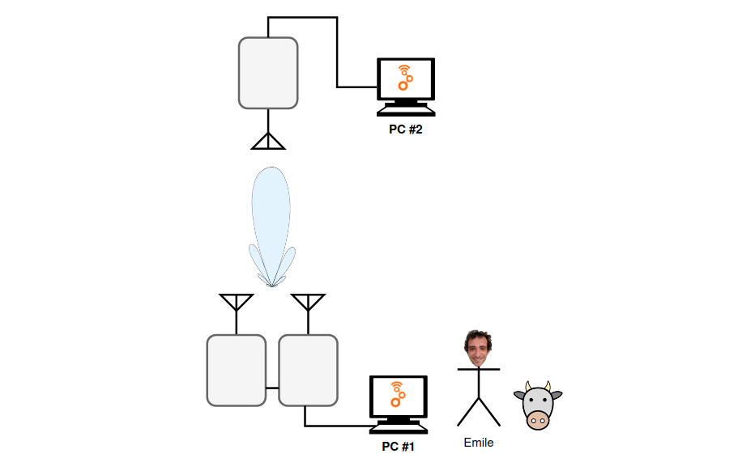
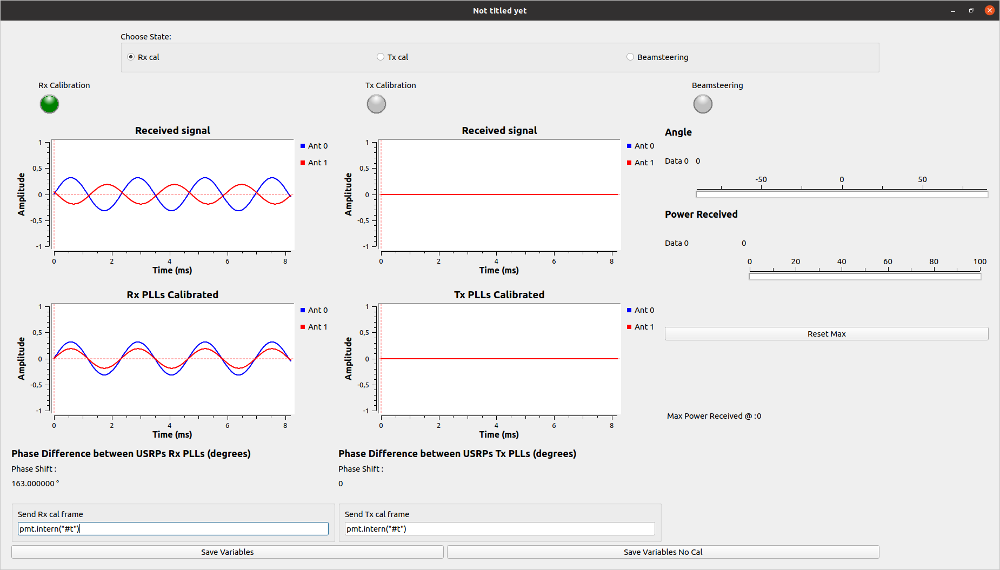
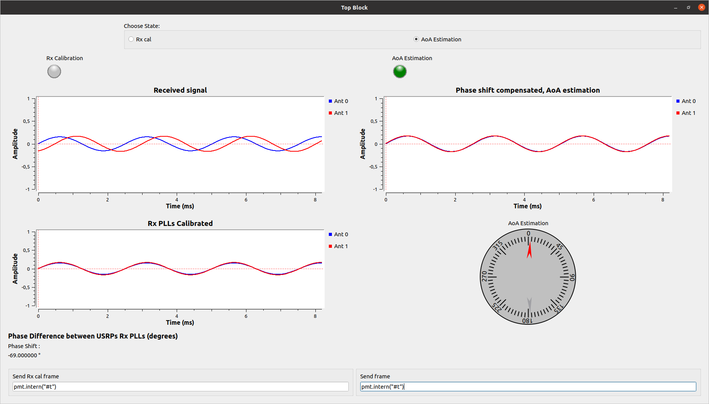

## Introduction

This is a collection of GNU Radio flowgraphs used for experiments on MiSo/SiMo communications on NI USRP-2920.
This work has been conducted at the IETR lab in Rennes, France.

## Implemented functionalities

* Solving Tx & Rx carrier phase coherence problem between two USRPs by adding a calibrating step. 
* Usage example (2x1 MiSo): Beamsteering using 2 calibrated USRPs at Tx.
* Usage example (1x2 SiMo): AoA estimation using 2 calibrated USRPs at Rx.

## Reference

TODO : Link to intership report

## Prerequisites

* GNU Radio 3.10 
* Python 3.8
* UHD (for USRP communication w/ computer)

## Installation

* Download the zip archive and extract it

## Usage

* ``UE/ue_script.grc`` is the script to be run on UE (user equipment), it is the same for both BS (base station) scripts examples. The goal of this script is to record received power and send frames when asked.

* ``/BS/DBS_Tx_cal/tx_rx_cal_dbs/tx_rx_cal_dbs.grc`` is an usage example for 2x1 MiSo to be run on BS. The GUI is divided in 3 columns, send the Rx calibration frame to calibrate Rx PLLs, send the Tx calibration frame to calibrate Tx PLLs. Last column is dedicated to beamsteering, the script will scan the beam through every angle to see where the UE is getting the most power.

* ``BS/DoA_Rx_cal/DoA_Rx_cal/cal_doa.grc`` is an usage example for 1x2 SiMo to be run on BS. The GUI is divided in 2 columns, send the Rx calibration frame to calibrate Rx PLLs, then, physically move the UE while sending frames with it to see the compass move on the GUI.

## Notes

* Possible improvements include :
    - Implementing MiMo channel estimation
    - Adding precoders that require MiMo channel estimation (CB, MRT, MRC)
    - Adding more antennas (2x2 MiMo ...)